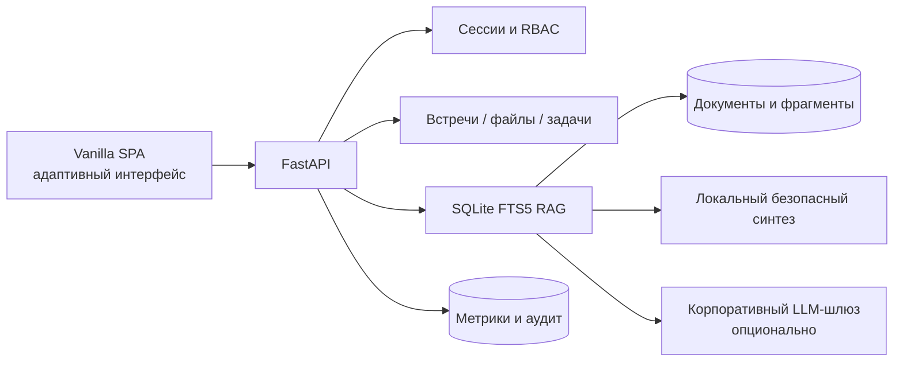

# Архитектура MVP

## Алгоритм ответа

1. API определяет пользователя по сессии.
2. Поиск получает только фрагменты документов, разрешённых роли.
3. Система ранжирует фрагменты и оценивает уверенность.
4. При подключённом шлюзе контекст отправляется генеративной модели с инструкцией отвечать только по источникам.
5. При недоступности шлюза используется локальный синтез.
6. Пользователь получает ответ, карточки документов, уверенность и latency.
7. Запрос и качество фиксируются для мониторинга.

## Переход к пилоту

- заменить демо-сессии на корпоративный SSO/IAM;
- подключить утверждённое объектное хранилище и промышленный векторный индекс;
- добавить API-шлюз к почте, календарю, Jira, HR и корпоративному диску;
- вынести фоновые задачи индексации в очередь;
- добавить DLP, шифрование секретов и неизменяемый журнал аудита;
- провести разметку тестового набора для Answer Accuracy и hallucination rate.
